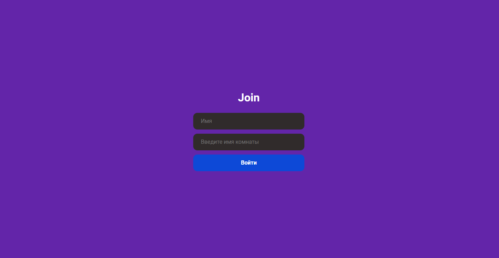
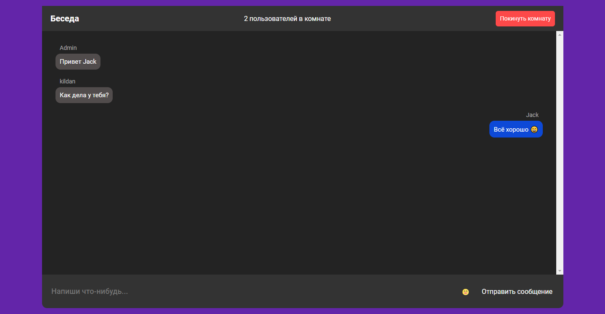
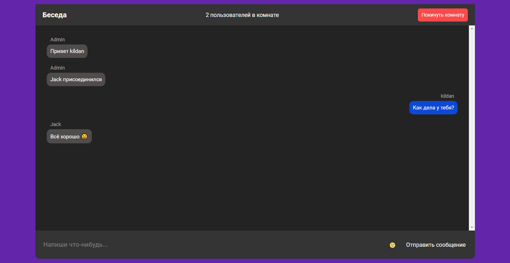

# Онлайн чат с комнатами

Данное онлайн приложение даёт возможность переписываться с людьми в отдельных комнатах.

## Требования

-   Node.js
-   Socket-io
-   React
-   React-router-dom
-   Деплой сервер части на Render
-   Деплой клиент части на Vercel

## Функции

-   Авторизироваться под своим именем
-   Присоединениться к комнате
-   Чат в реальном времени
-   Обработка подключения пользователя в комнату
-   Выход из комнаты

<!--  -->

